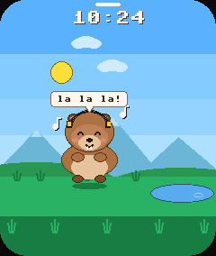
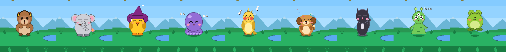
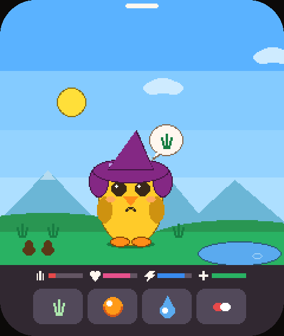
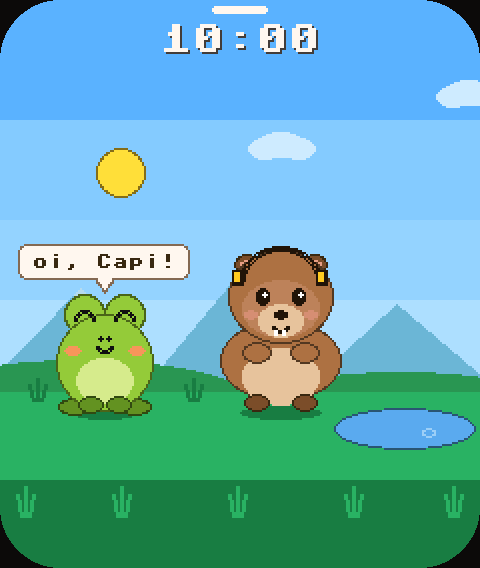
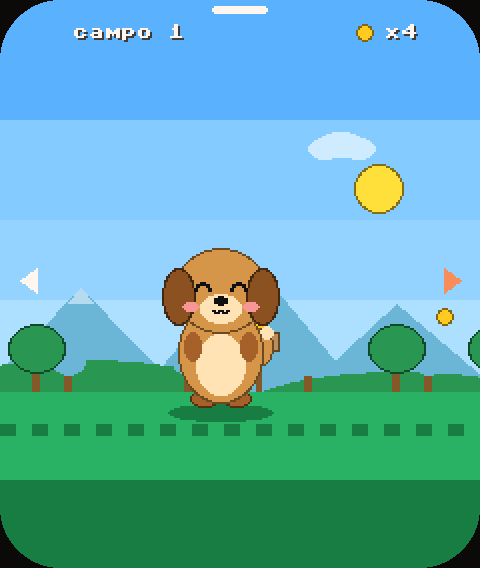
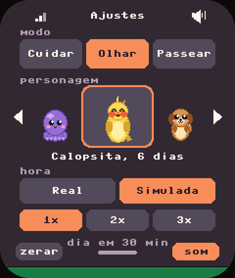
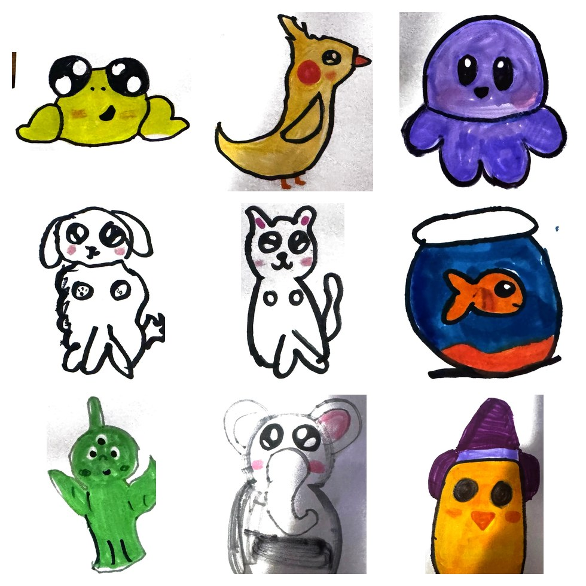

<p align="center">
  
</p>

<h1 align="center">Capigoshi</h1>

<p align="center">
  Um bichinho virtual de bolso, feito em MicroPython para uma plaquinha com tela touch.<br>
  Ele nasce de um ovo, cresce, brinca, dorme, fala com voz de minion e um dia vira estrela.
</p>

<p align="center">
  <a href="https://capigoshi.mundocapi.com">Site</a> ·
  <a href="#começando">Começando</a> ·
  <a href="#como-brincar">Como brincar</a> ·
  <a href="#ver-sem-a-placa">Ver sem a placa</a> ·
  <a href="CONTRIBUTING.md">Contribuir</a> ·
  <a href="LICENSE">Licença MIT</a>
</p>

> **English summary:** Capigoshi is an open-source virtual pet (think Tamagotchi) for the Waveshare
> ESP32-S3-Touch-LCD-1.83 board, written in plain MicroPython. Nine characters (all created by a
> 9-year-old), a day/night diorama, a life cycle from egg to star, 21 idle animations, and reactions to touch,
> shaking and noise. Everything is drawn with `framebuf` primitives, no bitmaps. Docs are in Portuguese;
> issues and PRs in English are welcome.

---

## O que é

O Capigoshi é um tamagotchi moderno que mora numa placa de 1,83" com tela touch, acelerômetro,
microfone, alto-falante e relógio. Tudo o que aparece na tela é desenhado por código, com elipses,
retângulos, triângulos e texto 8 × 8. Não há nenhuma imagem guardada na placa.

<p align="center"></p>

- **9 personagens:** Capi, Elefante, Pato, Polvo, Calopsita, Caramelo, Gato, ET e Sapinho. Todos
  foram criados pelo João, de 9 anos, e os traços dele foram mantidos, não "corrigidos".
- **Ele está vivo:** respira, sorteia um de 21 movimentos conforme a hora (dançar, cambalhota,
  cheirar flor, esconder num buraco, espirrar…) e fala com voz de minion.
- **Ele reage:**
  - **toque:** carinho;
  - **segurar e arrastar:** colo;
  - **sacudir a placa:** fica tonto;
  - **barulho:** leva susto;
  - **10 min sem atenção:** chora e chama.
- **Ciclo de vida:** o ovo choca em 10 min. Depois vêm filhote, adulto e idoso (bengala e
  sobrancelhas brancas). Entre 23 e 40 dias depois, numa noite, ele vira estrela com o nome no céu, e de
  manhã aparece um ovo novo.
- **Diorama do dia:** 6 fases de céu, com sol e lua em arco, estrelas, nuvens, montanhas e lago.
  Ele dorme das 22h às 6h.
- **Três modos:**
  - **Cuidar:** fome, alegria, energia, saúde, cocô e doença.
  - **Olhar:** ele vive sozinho, com rotina e visitas.
  - **Passear:** um side-scroller com moedas.

| Cuidar | Olhar (conversa com vizinho) | Passear | Menu puxado do topo |
|:--:|:--:|:--:|:--:|
|  |  |  |  |

## Feito pelo João

Os personagens, os movimentos e as ações do Capigoshi foram criados pelo João, de 9 anos. O código só
traduziu cada traço do desenho dele para a tela, sem corrigir nada. Veja cada desenho ao lado do bichinho
que ele virou [na página do projeto](https://capigoshi.mundocapi.com/#joao).

<p align="center"></p>

## Hardware

- **Placa:** [Waveshare ESP32-S3-Touch-LCD-1.83](https://www.waveshare.com/wiki/ESP32-S3-Touch-LCD-1.83)
  - ESP32-S3 com 8 MB de PSRAM
  - tela ST7789 de 240 × 284
  - toque CST816D
  - acelerômetro QMI8658
  - relógio PCF85063
  - áudio ES8311 + ES7210
  - energia AXP2101
- **Bateria de lítio (opcional):** a placa tem conector. Com bateria, o relógio não perde a hora, e
  a tela avisa quando ela chega a 10%.
- **Cabo USB-C.**

## Começando

Você precisa de Python 3 e de um Mac ou Linux (no Windows, use os comandos do passo 3 à mão).

```bash
pip install esptool mpremote
git clone https://github.com/rjcaubit/capigoshi.git && cd capigoshi
```

**1. Coloque a placa em modo de gravação.** Segure **BOOT**, aperte e solte **RST**, e solte **BOOT**.

**2. Grave tudo.**

```bash
bash deploy.sh                 # baixa o MicroPython, grava, copia os arquivos e acerta o relógio
```

O `deploy.sh` apaga a placa antes de gravar. Para atualizar só os arquivos sem perder o bichinho (com
a placa ligada normalmente, sem modo de gravação):

```bash
bash deploy.sh --so-arquivos
```

**3. Sem o script:** grave o firmware `ESP32_GENERIC_S3-SPIRAM_OCT` do
[micropython.org](https://micropython.org/download/ESP32_GENERIC_S3/) e copie os arquivos:

```bash
mpremote cp main.py hw.py desenho.py vida.py : + cp -r sons : + reset
```

### Sons extras (opcional)

A pasta `sons/` já vem com efeitos da Kenney (CC0). A voz de minion e alguns efeitos mais caprichados
são do Pixabay, cuja licença não permite redistribuir o arquivo solto, então eles não vêm no
repositório. Para usá-los:

1. Abra os links listados em [`sons/pixabay.sh`](sons/pixabay.sh) e clique em **Free download** em cada um.
2. Rode `bash sons/pixabay.sh`. Os sons vão para `sons/extra/`, que fica fora do git.

Sem esses arquivos o jogo funciona igual, só fala sem voz.

### Hora

O relógio da placa não precisa de internet: o `deploy.sh` acerta a hora com a do seu computador, e o
menu tem os botões **-1m / -1h / +1h / +1m**. Se quiser acertar pela internet, copie
`wifi_exemplo.json` para `wifi.json`, preencha a rede e mande para a placa. O `wifi.json` fica fora
do git.

## Como brincar

| Gesto | O que acontece |
|---|---|
| Puxar a tela de cima para baixo | Abre os **Ajustes**: modo, personagem, hora Real ou Simulada (dia em 30, 15 ou 10 min), som, zerar |
| Tocar no bichinho | Carinho. Cinco toques seguidos e ele pede "chega de cosquinha!" |
| Tocar fora dele | Ele olha em volta |
| Segurar e arrastar | Colo. Ele reclama, e cai quando você solta |
| Sacudir a placa | Grita, chacoalha e fica tonto. Se estiver dormindo, acorda por 1 minuto |
| Barulho perto | Leva susto e olha em volta |
| Tocar no ovo | Aquece e adianta o choco em 20 s |
| Botões do Cuidar | Comer, brincar, banho, remédio |
| Passear | Segure um lado da tela para andar. Toque curto pula. 3 toques rápidos no mesmo lado: anda sozinho |
| Botão BOOT | Fecha o menu e volta do Passear |

Trocar de personagem ou **zerar** começa do zero, com um ovo novo, e o jogo pergunta antes.

## Ver sem a placa

A pasta [`previa/`](previa/) roda o firmware de verdade (`main.py`, `desenho.py` e `vida.py`, sem
cópia nem imitação) no MicroPython do computador. O hardware é simulado, e as telas saem em PNG:

```bash
brew install micropython        # ou: apt install micropython
cd previa
micropython rodar.py            # roda os cenários e os testes (ciclo de vida, menu, sono, bateria...)
python3 montar.py               # converte as telas em PNG, com os cantos do vidro (precisa do Pillow)
```

O `rodar.py` também funciona como teste automático: se alguma regra do jogo quebrar, ele para com
`AssertionError`.

## Ajustes

As principais constantes ficam no topo do [`main.py`](main.py):

| Constante | O que controla | Padrão |
|---|---|---|
| `DORME`, `ACORDA` | Horário de sono | 22h e 6h |
| `OVO_MINUTOS` | Quanto tempo o ovo leva para chocar (minutos de verdade) | 10 |
| `VIDA_TOTAL` | Dias de vida, sorteados no ovo | 23 a 40 |
| `FOME_MIN`, `CHANCE_DOENCA`… | Ritmo do modo Cuidar | |
| `LIMIAR_GRITO`, `BARULHO_SEGUIDOS` | Sensibilidade do microfone | |
| `LIMIAR_SACUDIDA` | Força da sacudida, em g | 0,9 |
| `BATERIA_FRACA` | Porcentagem em que a tela avisa | 10% |

No [`vida.py`](vida.py) ficam os movimentos, as falas de cada personagem, o repertório de cada hora do
dia e o tempo até ele chorar de saudade (`IGNORADO_MS`).

## Estrutura

```
main.py        lógica do jogo: modos, menu, ciclo de vida, sensores, toque
vida.py        comportamento: 21 movimentos, falas, reações (sem desenho, sem hardware)
desenho.py     tudo o que aparece na tela: cena, 9 personagens, balões, HUD, menu, efeitos
hw.py          drivers: tela, toque, acelerômetro, relógio, áudio e bateria
deploy.sh      grava o MicroPython e copia os arquivos, acertando o relógio
sons/          efeitos .raw (16 kHz, 16 bits, estéreo) e o script dos sons do Pixabay
previa/        roda o firmware no computador e gera PNGs (também serve de teste)
docs/          landing page e imagens
design_handoff_capigoshi_1c/   especificação visual "1c Diorama" (cores, coordenadas, renderizador de referência)
```

### Como o desenho funciona

- **Uma fonte de verdade.** O `desenho.py` é a tradução de um renderizador de referência em JS
  (`design_handoff_capigoshi_1c/capigoshi-render.js`), que só usa o que o `framebuf` da placa tem.
- **Cores em RGB565.** Toda cor passa por RGB565.
- **Contorno.** O contorno de cada forma é a mesma forma 1 px maior, na cor da forma × 0,5.
- **Movimentos.** Os movimentos esticam, espelham e giram o personagem com uma transformação aplicada
  a cada primitiva, porque o `framebuf` não tem `scale`, `rotate` nem recorte.
- **Esconder no buraco.** Para esse movimento, o chão é repintado por cima do personagem.

## Se algo não funcionar

- **Imagem deslocada ou com uma faixa:** ajuste a linha `self._cmd(0x2B, ...)` em `hw.py`.
- **Imagem com falhas:** baixe `baudrate=40_000_000` para `24_000_000` em `hw.py`.
- **Sem som ou microfone:** o jogo continua funcionando e mostra o motivo no terminal do Thonny ou do
  `mpremote`. O áudio é configurado registrador por registrador, então é a primeira coisa a conferir.
- **Ele se assusta à toa, ou não ouve nada:** ponha `MOSTRAR_VOLUME = True` no `main.py`, rode pelo
  Thonny e ajuste `LIMIAR_GRITO` olhando os números.
- **A placa não entra em modo de gravação:** segure BOOT, aperte e solte RST, e só então solte BOOT.
  A porta costuma ser `/dev/cu.usbmodem101` no Mac (`bash deploy.sh /dev/sua-porta` para outra).
- **Aviso de bateria nunca aparece:** a placa precisa de bateria ligada no conector. Sem bateria o
  chip de energia responde "sem bateria" e o aviso fica desligado.

O guia antigo, mais detalhado, continua em [LEIA-ME.md](LEIA-ME.md).

## Roadmap

- [ ] Clima (chuva, frio), estações e festas do ano no modo Olhar
- [ ] Colo e reações também durante comer, banho e pôr do sol
- [ ] Construções no cenário (fogueira, barquinho, cabana)
- [ ] Mais personagens desenhados por crianças. [Mande o seu!](CONTRIBUTING.md#novos-personagens)

## Contribuir

Contribuições são muito bem-vindas: código, personagens, falas, traduções e sons. Leia o
[CONTRIBUTING.md](CONTRIBUTING.md) e o [Código de Conduta](CODE_OF_CONDUCT.md).

## Créditos e licença

O código está sob a [licença MIT](LICENSE). Sons, fontes e outras peças de terceiros têm licenças
próprias, listadas em [CREDITOS.md](CREDITOS.md).
